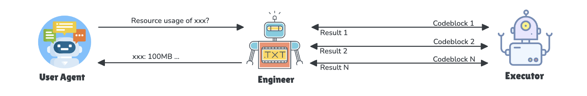
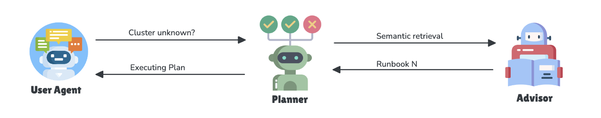
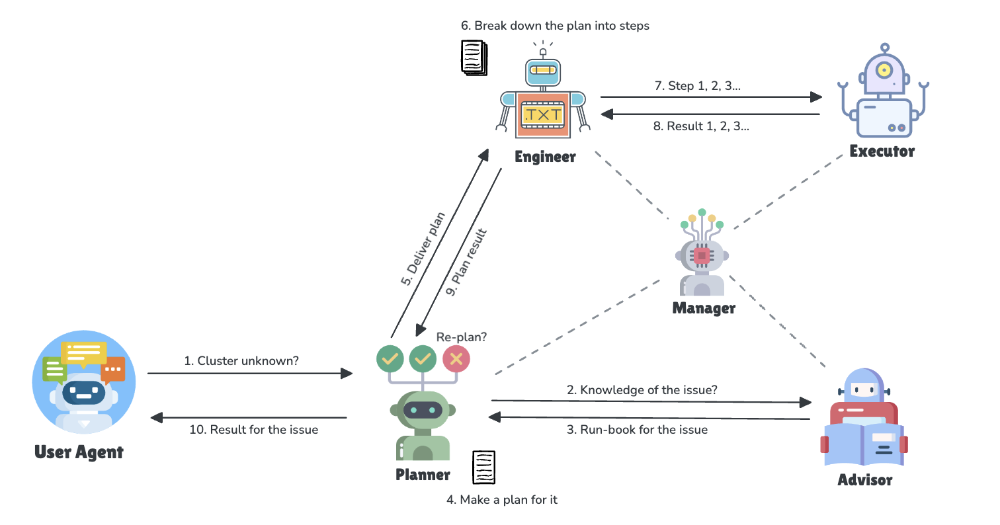

# ACM Agents

This is a multi-agent system for troubleshooting Kubernetes applications. Its initial implementation focuses on diagnosing the Open (or Advanced) Cluster Management environment, but it can be customized for other products as well.

## Environment

We set up an Open Cluster Management environment to demonstrate how it works.

- [Installation](https://open-cluster-management.io/docs/getting-started/quick-start/)

Install clusteradm CLI tool
Run the following command to download and install the latest clusteradm command-line tool:

```bash
curl -L https://raw.githubusercontent.com/open-cluster-management-io/clusteradm/main/install.sh | bash
```

Setup hub and managed cluster
Run the following command to quickly setup a hub cluster and 2 managed clusters by kind.

```bash
curl -L https://raw.githubusercontent.com/open-cluster-management-io/OCM/main/solutions/s
```

## Organize Agents

### Task 1: Interact with the Kubernetes Environment



- User: The user who ask questions and give tasks
- Executor: Execute the code written by the 'Engineer' and report the results back to them
- Engineer: Analyze the intent of the user or planner to write a sequence of shell commands or scripts

#### Demos

  <div style="display: flex; gap: 5px;">
    <a href="https://asciinema.org/a/673721" target="_blank">
      
    </a>
    <a href="https://asciinema.org/a/673715" target="_blank">
      
    </a>
  </div>

### Task 2: Add Knowledge Advisor for ACM



- Planner - Kubernetes planner, responsible for making a detailed plan to accomplish a specific task within a Kubernetes environment

- Advisor - The knowledge repository where you can find solutions and ideas for addressing any multi-cluster issues

### Task3: Orchestrate all agents within the system



- Manager - orchestrates the workflow between agents

#### Demo

<!-- [](https://asciinema.org/a/673919) -->
<div style="display: flex; gap: 5px;">
  <a href="https://asciinema.org/a/673919" target="_blank">
    
  </a>
</div>

#### Scenario 1: cluster1 status unknown - bootstrap hub kubeconfig is degraded

- Make the bootstrap hub kubeconfig invalid

```bash
# kubectl edit secret bootstrap-hub-kubeconfig -n open-cluster-management-agent --context kind-cluster1
# kubectl edit secret hub-kubeconfig-secret  -n open-cluster-management-agent --context kind-cluster1

kubectl delete secret bootstrap-hub-kubeconfig -n open-cluster-management-agent --context kind-cluster1
kubectl delete secret hub-kubeconfig-secret  -n open-cluster-management-agent --context kind-cluster1
```

- Wait until the status is unknown

```bash
kubectl get mcl cluster1 --context kind-hub
```

- troubleshooting the unknown issue

```python
python main.py "why the status of cluster1 is unknown?"
```

[](https://asciinema.org/a/674162)

#### Scenario 2: cluster2 status unknown - disable the klusterlet agent and registration agent

- Scale these 2 agents to 0

```bash
kubectl scale deployment klusterlet -n open-cluster-management --replicas=0 --context kind-cluster2

kubectl scale deployment klusterlet-registration-agent -n open-cluster-management-agent --replicas=0 --context kind-cluster2
```

- Wait until the status is unknown

```bash
kubectl get mcl cluster2 --context kind-hub
```

- Troubleshooting the unknown issue

```shell
python main.py "why the status of cluster2 is unknown"
```

[](https://asciinema.org/a/674155)
